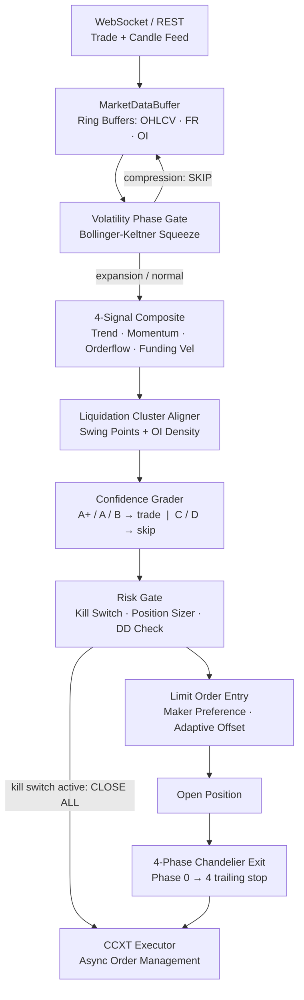

# APFTS v3 — Advanced Perpetual Futures Trading Strategy

A fully modular, production-grade algorithmic trading system for crypto perpetual futures.
Built on three research pillars that systematically target higher signal quality, better
risk-reward, and reduced cost drag — all within a **single shared strategy engine** consumed
identically by the backtester and the live async bot.

---

## How the System Works

APFTS v3 generates, filters, and manages directional trades on perpetual futures markets
using four orthogonal signals combined with a volatility regime gate and liquidation-cluster
entry alignment.

### Architecture



### Three Pillars

**Pillar 1 — Signal Quality & Filtering**

| Component | Purpose |
|---|---|
| Volatility Classifier | TTM Squeeze: skip compression (whipsaw), enter on expansion |
| 4-Signal Composite | Trend + Momentum + Orderflow + Funding Velocity — weighted by regime |
| Liquidation Mapper | Score entry alignment to nearby liq clusters; cascade amplifies your trade |
| Grading (A+/A/B/C) | Only trade B+ grades; C/D signals discarded |

**Pillar 2 — Trade Management**

| Component | Purpose |
|---|---|
| Market-Structure SL | SL behind nearest swing point — tighter and more meaningful than fixed ATR |
| 4-Phase Chandelier | Breakeven at +1R, trail 2.5x at +1.5R, tighten progressively to 1xATR at +4R |
| Regime-Adaptive TP | 5x risk for trending regimes, 3x for mean-reverting |

**Pillar 3 — Perpetual-Specific Edge**

| Component | Purpose |
|---|---|
| Limit Entry Preference | Post-only orders save ~3.5 bp vs taker; adaptive offset by vol regime |
| Funding Velocity Signal | Rate of change of funding rate — leading crowding indicator |
| Liquidation Magnet | Enter toward dense liq clusters; forced liquidations amplify the move |

---

## Features

- **Single shared strategy engine** — zero code duplication between backtest and production
- **Modular Python package** — `pip install -e .` with proper namespace
- **Pydantic v2 config** — all parameters overridable via `.env`
- **Structlog** — structured logging to console + rotating file
- **Graceful shutdown** — SIGTERM/SIGINT caught, all positions closed at market
- **Kill switch** — auto-trigger on max drawdown or daily loss breach
- **Limit-order preference** — maker rebates built into the execution layer
- **4-phase Chandelier** — non-linear trailing that captures full trends
- **Market-structure SL** — swing-based stops, not fixed ATR multiples
- **Funding velocity** — orthogonal 4th signal based on FR rate-of-change
- **Liquidation cluster detection** — OI + swing-point model for entry timing

---

## Installation & Setup

### 1. Clone and install

```bash
git clone https://github.com/yourname/perpetual-futures-trading-strategy.git
cd perpetual-futures-trading-strategy
python -m venv .venv && source .venv/bin/activate   # Windows: .venv\Scripts\activate
pip install -e ".[dev]"
```

### 2. Create your `.env`

```bash
cp .env.example .env
```

Edit `.env`:

```dotenv
EXCHANGE_ID=binanceusdm
EXCHANGE_API_KEY=your_api_key_here
EXCHANGE_API_SECRET=your_api_secret_here
EXCHANGE_TESTNET=true          # Always start on testnet!

TRADING_SYMBOL=BTC/USDT:USDT
TRADING_LEVERAGE=5

MAX_DRAWDOWN_PCT=15.0
KILL_SWITCH_DRAWDOWN=20.0
MAX_DAILY_LOSS_PCT=5.0
```

---

## Usage

### Run the Backtest

```bash
# Default: 10 000 synthetic bars, 5 seeds
apfts-backtest

# Custom parameters
apfts-backtest --bars 20000 --seeds 42,123,456 --capital 50000 --log-level DEBUG

# Or directly
python -m src.backtest.engine
```

**Example output:**
```
========================================================================
  APFTS v3 — DEEP ALPHA BACKTEST
========================================================================

  Seed 42: Trades=87 | WR=53.4% | R:R=1.82x | Exp=+0.148% | PF=1.81 | DD=3.21% | Ret=+9.43% | Exec=8.1bp
    Grade A: 34 trades, WR=61.8%, Exp=+0.231%
    Exits: stop_loss:31 | take_profit:18 | time_exit:12 | trail_phase_2:26

  CROSS-SEED SUMMARY
  Win Rate      : 53.8%
  R:R           : 1.79x
  Expectancy    : +0.141%
  Profit Factor : 1.76
  Max Drawdown  : 3.45%
  Total Return  : +8.91%
```

### Run the Live Bot

```bash
apfts-bot

# Or directly
python -m src.production.bot
```

### Run Tests

```bash
pytest tests/ -v
```

---

## Configuration Options

All options configurable via `.env` or environment variables.

| Variable | Default | Description |
|---|---|---|
| `EXCHANGE_ID` | `binanceusdm` | CCXT exchange ID |
| `EXCHANGE_API_KEY` | — | Exchange API key |
| `EXCHANGE_API_SECRET` | — | Exchange API secret |
| `EXCHANGE_TESTNET` | `true` | Use sandbox/testnet |
| `TRADING_SYMBOL` | `BTC/USDT:USDT` | Perpetual futures symbol |
| `TRADING_LEVERAGE` | `5` | Leverage (1–20 recommended) |
| `MAX_DRAWDOWN_PCT` | `15.0` | Soft drawdown limit |
| `KILL_SWITCH_DRAWDOWN` | `20.0` | Hard stop — closes all positions |
| `MAX_DAILY_LOSS_PCT` | `5.0` | Intraday loss limit |
| `LOG_LEVEL` | `INFO` | Logging verbosity |

Strategy parameters (edit `config/config.py`, `StrategyConfig`):

| Parameter | Default | Description |
|---|---|---|
| `composite_threshold` | `0.25` | Min composite to consider a trade |
| `min_signal_agreement` | `2` | Minimum signals that must agree (of 4) |
| `tp_mult_trending` | `5.0` | Take-profit multiple in trending regime |
| `tp_mult_normal` | `3.0` | Take-profit multiple in mean-reverting regime |
| `max_hold_bars` | `96` | Forced time-exit after N bars |
| `limit_wait_bars` | `3` | Max bars to wait for limit fill |

---

## Strategy Logic

### Signal Sources

1. **Trend Signal** — EMA8/21/55 stack (40%) + higher-high/higher-low structure (35%) + VWAP (25%)
2. **Momentum Signal** — RSI with regime-adaptive thresholds (35%) + MACD histogram acceleration (35%) + price ROC velocity (30%)
3. **Orderflow Signal** — CVD divergence (60%) + 10-bar buy/sell volume imbalance (40%)
4. **Funding Velocity** — Counter-trend signal based on rate of change of funding rate; orthogonal to price

### Regime-Adaptive Weights

| Regime | Trend | Momentum | Orderflow | Funding |
|---|---|---|---|---|
| Trending | 40% | 25% | 15% | 20% |
| Mean-Reverting | 10% | 35% | 30% | 25% |
| High-Vol | 20% | 20% | 35% | 25% |
| Normal | 25% | 25% | 30% | 20% |

### Entry Rules (all must pass)

1. Volatility phase is NOT `COMPRESSION`
2. Weighted composite signal > ±0.25
3. Grade B or better (confidence > 0.20)
4. Recent 6-bar volume > 30% of 720-bar mean
5. At least 2 of 4 signals agree on direction
6. At least 1 of the last 3 bars moves in signal direction
7. Enter via limit order at adaptive offset; fall back to market if unfilled after 3 bars

### Exit Rules

| Phase | Trigger | Action |
|---|---|---|
| 0 | Initial | Hold market-structure SL |
| 1 | +1.0R reached | Move SL to breakeven +0.2R |
| 2 | +1.5R reached | Chandelier trail at 2.5xATR |
| 3 | +2.5R reached | Tighten trail to 1.5xATR |
| 4 | +4.0R reached | Very tight trail at 1.0xATR |
| — | Time | Market exit after `max_hold_bars` |
| — | Take-profit | Limit order at 3x–5x initial risk |

### Risk Rules

- 1% equity risk per trade, scaled by grade + drawdown + vol regime (half-Kelly)
- Kill switch auto-closes all positions at max drawdown threshold
- Daily loss limit halts new trades for the day
- Single-position mode by default (`max_open_trades=1`)

---

## Backtest Results Format

```
Trades=87        Total completed trades
WR=53.4%         Win rate
R:R=1.82x        Average win / average loss ratio
Exp=+0.148%      Average net PnL % per trade (after all costs)
PF=1.81          Profit factor (gross profit / gross loss)
DD=3.21%         Maximum drawdown
Ret=+9.43%       Total return over test period
Exec=8.1bp       Average round-trip execution cost (basis points)

Grade A: ...     Same metrics filtered to A/A+ signals only
Exits: ...       Breakdown by exit reason
Risk of Ruin     Gambler's ruin estimate at 50% capital loss level
```

---

## Project Structure

```
perpetual-futures-trading-strategy/
├── pyproject.toml          # pip install -e .
├── requirements.txt
├── .env.example
├── config/
│   └── config.py           # Pydantic BaseSettings
├── src/
│   ├── core/
│   │   ├── data_buffer.py  # RingBuffer + MarketDataBuffer
│   │   ├── volatility.py   # VolatilityClassifier (canonical, shared)
│   │   └── utils.py        # ema, rsi, atr, adx
│   ├── strategy/
│   │   ├── signals.py      # FundingVelocitySignal, LiquidationMapper, SignalEngineV3
│   │   ├── exits.py        # ChandelierExit, MarketStructureSL
│   │   └── engine.py       # V3StrategyEngine — shared by backtest + production
│   ├── execution/
│   │   ├── ccxt_client.py  # Async CCXT wrapper
│   │   ├── order_manager.py# LimitOrderManager
│   │   └── executor.py     # Order submit + retry
│   ├── risk/
│   │   ├── position_sizer.py
│   │   ├── risk_manager.py # RegimeClassifier, RiskManager
│   │   └── kill_switch.py  # Graceful shutdown + OS signal handler
│   ├── backtest/
│   │   ├── engine.py       # BacktestEngineV3 + synthetic data generator
│   │   └── metrics.py      # TradeRecord, BacktestMetrics
│   └── production/
│       └── bot.py          # Async bot (candle loop + position monitor)
└── tests/
    └── test_strategy.py
```

---

## Future Improvements

- **Live liquidation feed** — replace OI-model estimate with real exchange data (`/fapi/v1/forceOrders`)
- **WebSocket candle stream** — replace REST polling with true WS subscription for lower latency
- **Multi-symbol support** — run parallel instances across BTC/ETH/SOL perps
- **Walk-forward optimisation** — automated parameter tuning on rolling windows
- **Order book imbalance** — Level 2 bid-ask pressure as 5th orthogonal signal
- **Funding carry management** — hold positions through favourable funding windows
- **Telegram / Discord alerts** — real-time trade notifications and daily PnL reports
- **Database persistence** — store all trades to SQLite / TimescaleDB
- **Docker deployment** — containerised bot with auto-restart and health checks
