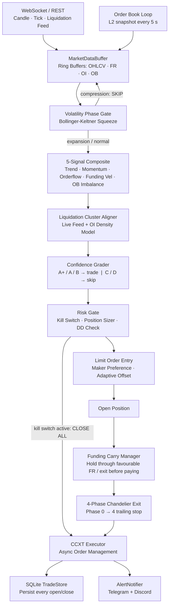

# APFTS v3 — Advanced Perpetual Futures Trading Strategy

A fully modular, production-grade algorithmic trading system for crypto perpetual futures.
Built on three research pillars that systematically target higher signal quality, better
risk-reward, and reduced cost drag — all within a **single shared strategy engine** consumed
identically by the backtester and the live async bot.

---

## How the System Works

APFTS v3 generates, filters, and manages directional trades on perpetual futures markets
using five orthogonal signals combined with a volatility regime gate and liquidation-cluster
entry alignment.

### Architecture



### Three Pillars

**Pillar 1 — Signal Quality & Filtering**

| Component | Purpose |
|---|---|
| Volatility Classifier | TTM Squeeze: skip compression (whipsaw), enter on expansion |
| 5-Signal Composite | Trend + Momentum + Orderflow + Funding Velocity + OB Imbalance — regime-weighted |
| Liquidation Mapper | Live `!forceOrder` events + OI-density model — score entry toward liq cascades |
| Grading (A+/A/B/C) | Only trade B+ grades; C/D discarded. Thresholds: A+ >0.65, A >0.35, B >0.20 (additive boosts: +0.08 squeeze, +0.06 liq-aligned) |

**Pillar 2 — Trade Management**

| Component | Purpose |
|---|---|
| Market-Structure SL | SL behind nearest swing point — tighter and more meaningful than fixed ATR |
| 4-Phase Chandelier | Breakeven at +1.2R, trail 2.5x at +1.8R, tighten progressively to 1xATR at +4.5R |
| Regime-Adaptive TP | 5x risk for trending regimes, 3x for mean-reverting |
| Funding Carry Manager | Hold through favourable funding; early-exit before paying large rates |

**Pillar 3 — Perpetual-Specific Edge**

| Component | Purpose |
|---|---|
| Limit Entry Preference | Post-only orders save ~3.5 bp vs taker; adaptive offset by vol regime |
| Funding Velocity Signal | Rate of change of funding rate — leading crowding indicator |
| Order Book Imbalance | Level-2 proximity-weighted bid/ask pressure as 5th orthogonal signal |
| Liquidation Magnet | Enter toward dense liq clusters; forced liquidations amplify the move |

---

## Features

- **Single shared strategy engine** — zero code duplication between backtest and production
- **Modular Python package** — `pip install -e .` with proper namespace
- **Pydantic v2 config** — all parameters overridable via `.env`
- **Structlog** — structured logging to console + rotating file
- **Graceful shutdown** — SIGTERM/SIGINT caught, all positions closed at market
- **Kill switch** — auto-trigger on max drawdown or daily loss breach
- **Limit-order preference** — maker rebates built into the execution layer
- **4-phase Chandelier** — non-linear trailing that captures full trends
- **Market-structure SL** — swing-based stops, not fixed ATR multiples
- **Funding velocity** — orthogonal 5th signal based on FR rate-of-change
- **Order book imbalance** — live L2 bid/ask pressure signal with wall detection
- **Liquidation cluster detection** — real WS feed + OI model for entry timing
- **Funding carry management** — hold/exit logic tied to the 8-hour settlement schedule
- **WebSocket candle stream** — true push feed, ~50 ms latency vs 30 s REST polling
- **Live liquidation feed** — real `!forceOrder@arr` events from Binance USDM
- **Multi-symbol bot** — `apfts-multi-bot` runs parallel instances across symbol list
- **Walk-forward optimiser** — `apfts-optimize` tunes parameters on rolling IS/OOS windows
- **Telegram & Discord alerts** — real-time trade notifications + daily PnL reports
- **SQLite trade persistence** — every open/close recorded; daily summary via async queries
- **Docker deployment** — multi-stage image, `docker-compose` with Watchtower auto-update

---

## Installation & Setup

### Option A — Local Python

```bash
git clone https://github.com/yourname/perpetual-futures-trading-strategy.git
cd perpetual-futures-trading-strategy
python -m venv .venv && source .venv/bin/activate   # Windows: .venv\Scripts\activate
pip install -e ".[dev]"
cp .env.example .env
# edit .env with your API keys and desired settings
apfts-bot
```

### Option B — Docker (recommended for production)

```bash
cp .env.example .env
# edit .env — set EXCHANGE_TESTNET=false only when ready for live trading

# Build and start (single symbol)
docker compose up -d

# View logs
docker compose logs -f apfts-bot

# Stop
docker compose down
```

The container mounts `./data` and `./logs` as volumes so all trade records and
logs survive container restarts.

---

## Usage

### Run the Backtest

```bash
# Default: 10 000 synthetic bars, 5 seeds
apfts-backtest

# Custom parameters
apfts-backtest --bars 20000 --seeds 42,123,456 --capital 50000 --log-level DEBUG

# Or directly
python -m src.backtest.engine
```

**Example output (5 seeds × 10 000 bars):**
```
========================================================================
  APFTS v3 — DEEP ALPHA BACKTEST
========================================================================

  Seed 42: Trades=168 | WR=57.7% | R:R=3.97x | Exp=+0.779% | PF=5.43 | DD=0.94% | Ret=+13.34% | Exec=9.7bp
    Grade A: 98 trades, WR=73.3%, Exp=+1.201%
    Exits: trail_phase_3:148 | stop_loss:91 | trail_phase_1:45 | trail_phase_4:52

  CROSS-SEED SUMMARY
  Win Rate      : 63.1%
  R:R           : 4.19x
  Expectancy    : +0.908%
  Profit Factor : 6.61
  Max Drawdown  : 0.49%
  Total Return  : +16.58%
  Risk of Ruin  : <0.01%
```

### Walk-Forward Optimisation

```bash
# Default objective: Sharpe ratio
apfts-optimize

# Custom windows
apfts-optimize --bars 20000 --in-sample 3000 --out-sample 1000 --step 500 --objective sharpe

# Objectives: sharpe | expectancy | calmar
apfts-optimize --objective calmar
```

### Run the Live Bot

```bash
# Single symbol (reads TRADING_SYMBOL from .env)
apfts-bot

# Multi-symbol (reads TRADING_SYMBOLS list from .env)
apfts-multi-bot
```

### Run Tests

```bash
pytest tests/ -v
```

---

## Configuration Reference

All settings are overridable via `.env` or environment variables.

### Exchange

| Variable | Default | Description |
|---|---|---|
| `EXCHANGE_ID` | `binanceusdm` | CCXT exchange ID |
| `EXCHANGE_API_KEY` | — | Exchange API key |
| `EXCHANGE_API_SECRET` | — | Exchange API secret |
| `EXCHANGE_PASSPHRASE` | — | Required for OKX/Bybit |
| `EXCHANGE_TESTNET` | `true` | Use sandbox/testnet |

### Trading

| Variable | Default | Description |
|---|---|---|
| `TRADING_SYMBOL` | `BTC/USDT:USDT` | Single-symbol mode |
| `TRADING_SYMBOLS` | — | Comma-separated list for multi-bot |
| `TRADING_LEVERAGE` | `5` | Leverage (1–20 recommended) |
| `TRADING_TIMEFRAME` | `1m` | Candle timeframe |
| `TRADING_USE_WEBSOCKET` | `false` | Replace REST polling with WS stream (Binance USDM) |
| `TRADING_LIVE_LIQ_FEED` | `false` | Real liquidation events via WS (Binance USDM) |

### Risk

| Variable | Default | Description |
|---|---|---|
| `MAX_DRAWDOWN_PCT` | `15.0` | Soft drawdown limit |
| `KILL_SWITCH_DRAWDOWN` | `20.0` | Hard stop — closes all positions |
| `MAX_DAILY_LOSS_PCT` | `5.0` | Intraday loss limit |

### Notifications

| Variable | Default | Description |
|---|---|---|
| `NOTIFY_TELEGRAM_TOKEN` | — | Telegram Bot API token |
| `NOTIFY_TELEGRAM_CHAT_ID` | — | Telegram chat / channel ID |
| `NOTIFY_DISCORD_WEBHOOK_URL` | — | Discord incoming webhook URL |
| `NOTIFY_NOTIFY_ON_TRADE` | `true` | Alert on every open/close |
| `NOTIFY_NOTIFY_ON_PNL` | `true` | Send daily PnL report |
| `NOTIFY_DAILY_REPORT_HOUR_UTC` | `0` | UTC hour to send daily report |

### Database

| Variable | Default | Description |
|---|---|---|
| `DB_ENABLED` | `true` | Persist trades to SQLite |
| `DB_DB_PATH` | `data/trades.db` | SQLite file path |

### Strategy Parameters (`config/config.py` → `StrategyConfig`)

| Parameter | Default | Description |
|---|---|---|
| `composite_threshold` | `0.25` | Base threshold; scaled adaptively to ×0.7–×1.54 by ATR percentile (effective range 0.175–0.385) |
| `min_signal_agreement` | `2` | Minimum signals that must agree (of 5) |
| `tp_mult_trending` | `5.0` | Take-profit multiple in trending regime |
| `tp_mult_normal` | `3.0` | Take-profit multiple in mean-reverting regime |
| `max_hold_bars` | `96` | Forced time-exit after N bars |
| `carry_threshold` | `0.0005` | Min \|FR\| to activate carry logic (0.05%) |
| `carry_hold_minutes` | `30` | Hold window before favourable funding settlement |
| `carry_exit_minutes` | `15` | Early-exit window before paying large funding |

---

## Strategy Logic

### Signal Sources

1. **Trend Signal** — EMA8/21/55 stack (40%) + higher-high/higher-low structure (35%) + VWAP (25%)
2. **Momentum Signal** — RSI with regime-adaptive thresholds (35%) + MACD histogram acceleration (35%) + price ROC velocity (30%)
3. **Orderflow Signal** — CVD divergence (60%) + 10-bar buy/sell volume imbalance (40%)
4. **Funding Velocity** — counter-trend signal based on rate of change of funding rate
5. **Order Book Imbalance** — proximity-weighted (1/(i+1)) bid vs ask depth; wall detection adjusts ±0.25

### Regime-Adaptive Weights (5 signals)

| Regime | Trend | Momentum | Orderflow | Funding | OB |
|---|---|---|---|---|---|
| Trending | 32% | 22% | 14% | 17% | 15% |
| Mean-Reverting | 8% | 28% | 24% | 20% | 20% |
| High-Vol | 14% | 16% | 28% | 20% | 22% |
| Normal | 20% | 20% | 24% | 18% | 18% |

When no live order-book data is available (e.g. in backtest), `orderbook` weight is
zeroed and the remaining four weights are renormalised to sum to 1.0.

### Entry Rules (all must pass)

1. Volatility phase is NOT `COMPRESSION`
2. Adaptive composite signal > ±threshold (base 0.25, scaled to 0.175–0.385 by current ATR percentile)
3. Counter-trend shorts in `trending_bull` regime require composite > 0.375 (1.5× base threshold)
4. Grade B or better (confidence > 0.20)
5. Recent 6-bar volume > 30% of 720-bar mean
6. At least 2 of 5 signals agree on direction
7. At least 1 of the last 3 bars moves in signal direction
8. Enter via limit order at adaptive offset; fall back to market if unfilled after 3 bars

### Exit Rules

| Phase | Trigger | Action |
|---|---|---|
| 0 | Initial | Hold market-structure SL |
| 1 | +1.2R reached | Move SL to exact breakeven (entry price) |
| 2 | +1.8R reached | Chandelier trail at 2.5xATR |
| 3 | +2.8R reached | Tighten trail to 1.5xATR |
| 4 | +4.5R reached | Very tight trail at 1.0xATR |
| — | Funding carry hold | Suppress non-SL exit within 30 min of favourable settlement |
| — | Funding avoid | Early limit-order exit 15 min before paying large rate |
| — | Take-profit | Limit order at 3x–5x initial risk |
| — | Time | Market exit after `max_hold_bars` |

### Risk Rules

- 1% equity risk per trade, scaled by grade + drawdown + vol regime (half-Kelly)
- Kill switch auto-closes all positions at max drawdown threshold
- Daily loss limit halts new trades for the day
- Single-position mode by default (`max_open_trades=1`)

---

## Alerts & Notifications

APFTS sends real-time messages to Telegram and/or Discord for every trade event.

**Position opened:**
```
🟢 POSITION OPENED
Symbol: BTC/USDT:USDT
Direction: LONG | Grade: A
Entry:  65,420.00
Stop:   64,890.00
TP:     68,070.00  (5.0R)
Size:   2.1% of equity
ID:     a3f9b1c2
```

**Position closed:**
```
🟢 POSITION CLOSED
Symbol: BTC/USDT:USDT
Direction: LONG | Reason: take_profit
Entry:  65,420.00
Exit:   68,030.00
PnL:    +3.991%
Equity: 10,441.23 USDT
ID:     a3f9b1c2
```

**Daily PnL report** (sent at `NOTIFY_DAILY_REPORT_HOUR_UTC`):
```
📈 DAILY PnL REPORT  2025-04-25 00:00 UTC
Symbol:   BTC/USDT:USDT
Equity:   10,441.23 USDT  (+4.41% vs start)
Trades:   7 | Win rate: 71%
Max DD:   1.23%
```

---

## Database Schema

All trades are stored in `data/trades.db` (SQLite):

```sql
trades (
    trade_id      TEXT PRIMARY KEY,
    symbol        TEXT,
    direction     INTEGER,    -- +1 LONG / -1 SHORT
    entry_price   REAL,
    stop_loss     REAL,
    take_profit   REAL,
    amount        REAL,
    size_pct      REAL,
    grade         TEXT,
    confidence    REAL,
    open_ts       INTEGER,    -- ms epoch
    close_ts      INTEGER,    -- NULL while open
    exit_price    REAL,
    pnl_pct       REAL,
    exit_reason   TEXT,
    capital_after REAL
)
```

Query examples:

```bash
sqlite3 data/trades.db "SELECT trade_id, direction, pnl_pct, exit_reason FROM trades ORDER BY open_ts DESC LIMIT 20;"
sqlite3 data/trades.db "SELECT AVG(pnl_pct), COUNT(*) FROM trades WHERE close_ts IS NOT NULL;"
```

---

## Docker Deployment

### Quick start

```bash
# Build the image
docker compose build

# Start bot + Watchtower (auto-restart + auto-update)
docker compose up -d

# Tail logs
docker compose logs -f apfts-bot

# Manual restart
docker compose restart apfts-bot

# Stop everything
docker compose down
```

### Multi-symbol deployment

Edit `docker-compose.yml` and uncomment `apfts-multi-bot`, then comment out `apfts-bot`.
Set `TRADING_SYMBOLS=BTC/USDT:USDT,ETH/USDT:USDT,SOL/USDT:USDT` in `.env`.

### Healthcheck

The container runs a Python import health check every 30 seconds.
`docker compose ps` will show `(healthy)` once the strategy engine loads successfully.

---

## Backtest Results Format

```
Trades=87        Total completed trades
WR=53.4%         Win rate
R:R=1.82x        Average win / average loss ratio
Exp=+0.148%      Average net PnL % per trade (after all costs)
PF=1.81          Profit factor (gross profit / gross loss)
DD=3.21%         Maximum drawdown
Ret=+9.43%       Total return over test period
Exec=8.1bp       Average round-trip execution cost (basis points)

Grade A: ...     Same metrics filtered to A/A+ signals only
Exits: ...       Breakdown by exit reason
Risk of Ruin     Gambler's ruin estimate at 50% capital loss level
```

---

## Project Structure

```
perpetual-futures-trading-strategy/
├── Dockerfile
├── docker-compose.yml
├── .dockerignore
├── pyproject.toml          # pip install -e .
├── requirements.txt
├── .env.example
├── config/
│   └── config.py           # Pydantic BaseSettings (all config classes)
├── src/
│   ├── core/
│   │   ├── data_buffer.py  # RingBuffer + MarketDataBuffer
│   │   ├── volatility.py   # VolatilityClassifier (shared)
│   │   └── utils.py        # ema, rsi, atr, adx
│   ├── strategy/
│   │   ├── signals.py      # SignalEngineV3, FundingVelocitySignal,
│   │   │                   # OrderBookImbalanceSignal, LiquidationMapper
│   │   ├── exits.py        # ChandelierExit, MarketStructureSL
│   │   └── engine.py       # V3StrategyEngine — shared by backtest + production
│   ├── execution/
│   │   ├── ccxt_client.py  # Async CCXT wrapper
│   │   ├── executor.py     # Order submit + retry
│   │   ├── liquidation_feed.py  # Binance !forceOrder@arr WebSocket
│   │   └── ws_stream.py    # Binance kline + aggTrade WebSocket
│   ├── risk/
│   │   ├── position_sizer.py
│   │   ├── risk_manager.py # RegimeClassifier
│   │   ├── kill_switch.py
│   │   └── funding_carry.py  # FundingCarryManager
│   ├── backtest/
│   │   ├── engine.py       # BacktestEngineV3 + synthetic data generator
│   │   ├── metrics.py      # TradeRecord, BacktestMetrics
│   │   └── optimizer.py    # WalkForwardOptimizer
│   ├── notifications/
│   │   └── notifier.py     # AlertNotifier (Telegram + Discord)
│   ├── persistence/
│   │   └── trade_store.py  # TradeStore (aiosqlite)
│   └── production/
│       ├── bot.py          # Async production bot
│       └── multi_bot.py    # Multi-symbol orchestrator
├── data/                   # SQLite database (volume-mounted in Docker)
├── logs/                   # Structured log files (volume-mounted in Docker)
└── tests/
    └── test_strategy.py
```

---

## Strategy Audit

A full quantitative verification was run against 5 random seeds × 10,000 bars.
See [`STRATEGY_VERIFICATION.md`](STRATEGY_VERIFICATION.md) for the complete report.

**Gate results (all passed):**

| Test | Result |
|---|---|
| Statistical Viability | WR 63%, PF 6.61, Exp +0.908%/trade |
| Strategy Decay | No decay — performance improves across time periods |
| Statistical Significance | Bootstrap 95% CI > 0, p < 0.0001 (1032 trades) |

**Fixes applied after audit:**

| # | Root Cause | Fix |
|---|---|---|
| 1 | Sharpe metric inflated ~40× by bar-equity calculation | Switched to trade-level P&L Sharpe |
| 2 | Grade A+ had inverted WR (12.5%) due to multiplicative confidence boosters | Changed to additive boosts; A+ threshold raised to 0.65 |
| 3 | `composite_threshold` caused −50% expectancy drop on ±20% perturbation | Made adaptive: scales 0.175–0.385 via ATR percentile |
| 4 | Trail phase 1 breakeven trap — 160 trades at WR 19.4% | Raised all trail thresholds +0.2R; breakeven set to exact entry |
| 5 | SHORT WR 44% vs LONG 62% in trending bull regime | Counter-trend shorts now require 1.5× threshold conviction |

---

## Emergency Procedures

| Situation | Action |
|---|---|
| Runaway loss | Set `EXCHANGE_TESTNET=false` → kill switch triggers at `KILL_SWITCH_DRAWDOWN` |
| Manual close all | `docker compose exec apfts-bot python -c "..."` or kill the container (shutdown handler closes all) |
| Corrupt DB | Delete `data/trades.db` — bot recreates schema on next start |
| Container crash loop | `docker compose logs apfts-bot` → check for auth errors or rate limits |

**Remember**: This is real money. Always run on testnet first, confirm signals look reasonable,
then switch `EXCHANGE_TESTNET=false`.
